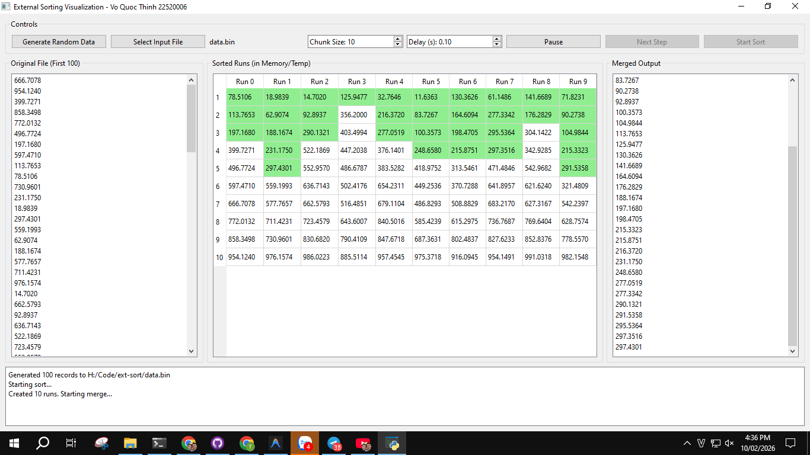

<!-- Banner -->

  

<h1 align="center"><b>CẤU TRÚC DỮ LIỆU GIẢI THUẬT NÂNG CAO</b></h>

## THÀNH VIÊN NHÓM
| STT    | MSSV          | Họ và Tên              |Chức Vụ    | Github                                                  | Email                   |
| ------ |:-------------:| ----------------------:|----------:|--------------------------------------------------------:|-------------------------:
| 1      | 22520006 | Võ Quốc Thịnh        |Nhóm trưởng|[quocthinhvo](https://github.com/quocthinhvo)  |22520006@gm.uit.edu.vn   |

## GIỚI THIỆU MÔN HỌC
* **Tên môn học:** Cấu trúc dữ liệu giải thuật nâng cao
* **Mã môn học:** CS523
* **Năm học:** HK2 (2025 - 2026)
* **Giảng viên**: thầy Nguyễn Thanh Sơn
* **Bài tập**: Tạo ứng dụng minh họa sắp xếp ngoại

